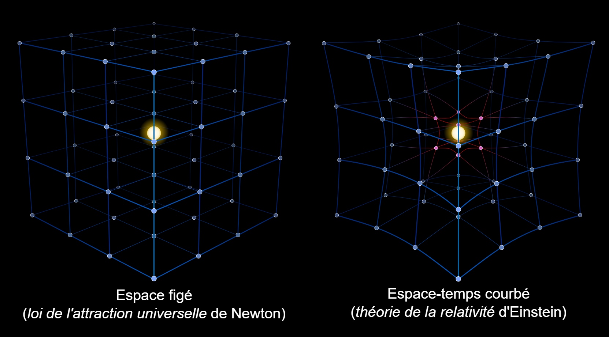

I honestly  don't know what to write in this first post. I just wanted to see how to create a blog and how to publish it using Quarto and github actions. \
I was thinking about creating different categories for my posts according to the topic. One category I would like to create is "coding", where I will share some notes and tips i learn while reading books and watching videos about programming.  I think it will help me to remember what I learn and also to share it with others who might be interested in the same topics. \
A second category i would like to create is related to linux. I have been using linux for a while now and I find it very useful and powerful, but sometimes it can be a bit overwhelming. I have decided to take the rhcsa certification, which is a certification for linux system administration. I will share my notes and tips about the topics covered in the exam, as well as some general tips and tricks for using linux. I hope that this category will be useful for anyone who is interested in learning more about linux or preparing for the rhcsa exam. \
A third category I would like to create is related to a field that i am very interested in, which is mathematics and general relativity. My plan was to create a series of posts with examples taken from different books that i am going to read. It has been a while since i studied these topics, so it will be a good opportunity to refresh my memory. I am not sure if i will be able to keep up with this plan but who knows, maybe i will stick to it more than the usual new year's resolutions. For now, i will simply use this post to test the formatting and the layout of the blog, and to see how it looks when published. I will start checking how the latex equations are rendered, since i will probably use a lot of them in the future posts. \
Inline equations like $E=mc^2$ just needs to be encapsulated between  single dollar signs, while display equations needs to be encapsulated between double dollar signs. For example, the following is a display equation:
$$\int_{-\infty}^{\infty} e^{-x^2} dx = \sqrt{\pi}$$
Next, we check how to include code snippets in the posts, since I will probably share some code in the future. I will use the following code snippet as an example: \
```{python}
print("Hello, world!")
```

This is a simple python code that prints "Hello, world!" to the console. I will probably use more complex code snippets in the future, but for now this is just a test to see how it looks when published. \
Finally, let's check how to include images in the posts. We can either add them as png/jpg: \  
 \
or we can  generate them using code and then include them in the post. For example, we can use the following code to generate a 3 dimensional sphere upon which a spherical triangle is drawn using matplotlib: \
```{python}
#| fig-cap: "Sphere with spherical triangle"
#| fig-width: 6
#| fig-height: 6
import numpy as np
import matplotlib.pyplot as plt
from mpl_toolkits.mplot3d import Axes3D

def sph(lat_deg, lon_deg):
    lat, lon = np.radians(lat_deg), np.radians(lon_deg)
    x = np.cos(lat) * np.cos(lon)
    y = np.cos(lat) * np.sin(lon)
    z = np.sin(lat)
    return np.array([x, y, z])

def great_circle_arc(u, v, n=200):
    dot = np.clip(np.dot(u, v), -1.0, 1.0)
    omega = np.arccos(dot)
    if omega < 1e-8:
        return np.tile(u, (n,1))
    t = np.linspace(0, 1, n)
    sin_omega = np.sin(omega)
    pts = (np.sin((1-t)*omega)[:,None]*u + np.sin(t*omega)[:,None]*v) / sin_omega
    return pts

# define 3 vertices (lat, lon) in degrees
A = sph(0, -40)
B = sph(70, -70)
C = sph(0, -100)

# sphere mesh
u = np.linspace(0, 2*np.pi, 80)
v = np.linspace(-np.pi/2, np.pi/2, 40)
U, V = np.meshgrid(u, v)
X = np.cos(V) * np.cos(U)
Y = np.cos(V) * np.sin(U)
Z = np.sin(V)

fig = plt.figure(figsize=(6,6))
ax = fig.add_subplot(111, projection='3d')
ax.plot_surface(X, Y, Z, rstride=3, cstride=3, color='lightblue', alpha=0.25, linewidth=0)

# draw arcs
for P,Q,color in [(A,B,'r'), (B,C,'g'), (C,A,'m')]:
    arc = great_circle_arc(P, Q)
    ax.plot(arc[:,0], arc[:,1], arc[:,2], color=color, lw=2)

# draw vertices
ax.scatter([A[0],B[0],C[0]], [A[1],B[1],C[1]], [A[2],B[2],C[2]], color='k', s=40)

# annotate approximate spherical angles (optional)
ax.text(A[0]*1.05, A[1]*1.05, A[2]*1.05, 'A')
ax.text(B[0]*1.05, B[1]*1.05, B[2]*1.05, 'B')
ax.text(C[0]*1.05, C[1]*1.05, C[2]*1.05, 'C')

def spherical_angle(a, b, c):
    ab = b - np.dot(a,b)*a
    ac = c - np.dot(a,c)*a
    ab /= np.linalg.norm(ab)
    ac /= np.linalg.norm(ac)
    return np.arccos(np.clip(np.dot(ab,ac), -1.0, 1.0))

# calcola angoli (radianti) e l'eccesso
alpha = spherical_angle(A, B, C)
beta  = spherical_angle(B, C, A)
gamma = spherical_angle(C, A, B)
excess = (alpha + beta + gamma) - np.pi

# helper per posizionare le etichette: usa la bisettrice tangenziale e uno spostamento piccolo
def label_pos(vertex, neigh1, neigh2, offset=0.15):
    v1 = neigh1 - np.dot(vertex, neigh1)*vertex
    v2 = neigh2 - np.dot(vertex, neigh2)*vertex
    v1 /= np.linalg.norm(v1); v2 /= np.linalg.norm(v2)
    bis = v1 + v2
    if np.linalg.norm(bis) < 1e-8:
        bis = v1
    bis /= np.linalg.norm(bis)
    return vertex + offset*bis

labA = label_pos(A, B, C, offset=0.12)
labB = label_pos(B, C, A, offset=0.12)
labC = label_pos(C, A, B, offset=0.12)

ax.text(labA[0], labA[1], labA[2], r'$\alpha\ =\ {:.1f}^\circ$'.format(np.degrees(alpha)),
        color='k', fontsize=10)
ax.text(labB[0], labB[1], labB[2], r'$\beta\ =\ {:.1f}^\circ$'.format(np.degrees(beta)),
        color='k', fontsize=10)
ax.text(labC[0], labC[1], labC[2], r'$\gamma\ =\ {:.1f}^\circ$'.format(np.degrees(gamma)),
        color='k', fontsize=10)


ax.set_box_aspect([1,1,1])
ax.set_axis_off()
plt.tight_layout()
plt.show()
```
'''
This code generates a 3D plot of a sphere with a spherical triangle defined by three vertices A, B, and C. The great circle arcs connecting the vertices are also plotted. The resulting image is included in the post to test how it looks when published. '''\